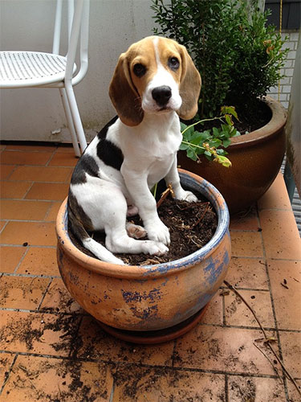

# A Keras deep learning REST API built using Flask and deployed on Kubernetes

In this project I created a deep learning REST API using the ResNet50 model (which has been trained on ImageNet) and Flask. I then dockerized this application and deployed on Kubernetes so it could be publically accessed on live on a scalable and reliable cluster.


## Starting the Keras server locally

Below you can see the image we wish to classify, a _dog_, but more specifically a _beagle_:



The Flask + Keras server can be started locally by running:

```sh
$ python app.py 
Using TensorFlow backend.
 * Loading Keras model and Flask starting server...please wait until server has fully started
...
 * Running on http://127.0.0.1:5000
```

## Deploying the Application to Kubernetes

Ensure you have Docker desktop installed. Then create an account or login into Google Cloud platform. They provide $300 free credits for new comers. Then set up and launch a Kubernetes cluster through the Kubernetes engine. 

From the Google Cloud home screen, select Kubernetes Engine:


Then create a new Kubernetes cluster:


Select 4vCPUs with 16 GBs of RAM. You can try this with a smaller cluster. Remember, the default settings spin up 3 nodes, so your cluster will have 3X the resources of what your provision:


After that, just click Create. It will take a minute or two for you cluster to spin up. Now you can connect to the cluster. Click Run in Cloud Shell to bring up the console for the Kubernetes cluster.


Now run the container which I have published on my Docker hub account:


```
kubectl run keras-app --image=lukeclarke12/keras-app --port 5000
```


Check the status of the pod that should now be running:


```
kubectl get pods
```


Then expose port 80 on the Kubernetes pod for the world to connect to:


```
kubectl expose deployment keras-app --type=LoadBalancer --port 80 --target-port 5000
```


Determine the status of your deployment:


```
kubectl get service
```


Now you should see an output where the EXTERNAL IP address of the keras-app is displayed. Grab that IP address and run the following command in your local terminal:


```
curl -X POST -F image=@dog.jpg 'http://<your service IP>/predict'
```


Results: 
1. beagle: 0.9726
2. Walker_hound: 0.0060
3. pot: 0.0043
4. bluetick: 0.0024
5. Basset: 0.0019

You can then try your own images and explore the results!
